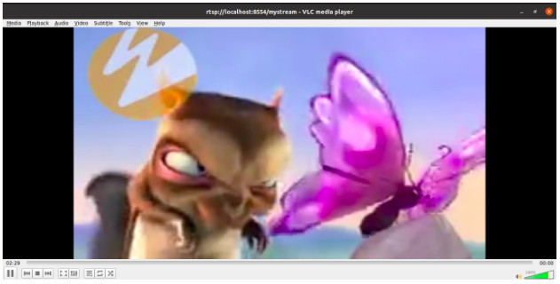

# Mediamtx Benchmark

1. Change into the mediamtx directory

    ```sh
    cd ../setup/k8s/mediamtx
    ```
2. Install Helm Chart.

    ```sh
    helm install mychart
    ```
3. To handle with the dynamic load on RTSP server, we need to autoscale our RTSP deployment (as per the requirement). To do that, we need to use the metrics-server. Download the configuration file of metrics server from official website.        

    ```sh
    wget https://github.com/kubernetes-sigs/metrics-server/releases/latest/download/components.yaml
    ```
4. Edit downloaded file and add ```- --kubelet-insecure-tls``` to args list.

<p align="center">

</p>

5. Deploy the metrics server on kubernetes.

    ```sh
    kubectl apply -f components.yaml 
    ```
6. Add hostNetwork: true to the spec of your metrics-server deployment by executing the following command:

    ```sh
    kubectl edit deployment -n kube-system metrics-server
    ```
7. It should look like the following:-

<p align="center">

</p>

8. Check the status of HPA, it should be something like:-

<p align="center">

</p>

9. Access the RTSP server from outside by port-forwarding:-

    ```sh
    kubectl port-forward deployments/rtsp 8554:8554
    ```

10. Let’s push a real-time-stream from local to RTSP server:-

   ```sh
   ffmpeg -ss 00:01 -rtsp_transport tcp -i rtsp://wowzaec2demo.streamlock.net/vod/mp4:BigBuckBunny_115k.mp4 -c copy -f rtsp -rtsp_transport tcp rtsp://localhost:8554/mystream
   ```

11. Access this stream from another terminal:-

   ```sh
   vlc rtsp://localhost:8554/mystream
   ```

12. Results:-

<p align="center">



</p>

13. Resources used by RTSP server(pod) for single publisher and single subscriber:-

<p align="center">

</p>

14. Resource limits and request:-

<p align="center">

</p>
